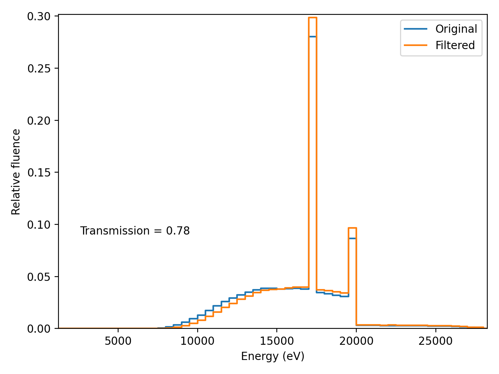

# hvl_calculator
Routine to calculate the Half Value Layer (HVL), effective energy and average energy of a spectrum.
Tested with Python 3.9.
Required packages listed in [requirements](./requirements.txt). 
Matplotlib is optional for plotting graphs.
This is an alpha version.

## Usage:

type in a terminal:  
python3 main.py -input 'configuration_file' -output 'output_folder'  
Replace 'configuration_file' with the path of the configuration file and 'output_folder' with the path
to save the results.\
An example of a [configuration file](./example/example.cfg) is provided. 

### Outputs:

Results output:
> --------HVLCalculator----------\
--------Version Alpha----------\
--------Results----------------\
Unfiltered spectrum\
HVL1 (mm of Aluminum): 0.286\
HVL2 (mm of Aluminum): 0.666\
Average Energy (eV): 16259.8\
Effective Energy (eV): 14343.1\
-------------------------------\
Filtered spectrum\
HVL1 (mm of Aluminum): 0.326\
HVL2 (mm of Aluminum): 0.739\
Average Energy (eV): 16639.4\
Effective Energy (eV): 14999.9

### New materials:

Some [materials](./example/materials) are provided, and new ones can be added if necessary.\
In principle, any attenuation coefficient database is compatible if the file follows the convention:
- First column must be the energy (in eV);
- Second column is the mass attenuation coefficient (in cm²/g);
- Third column (optional for filter materials)  is the mass energy-absorption coefficient (in cm²/g);

